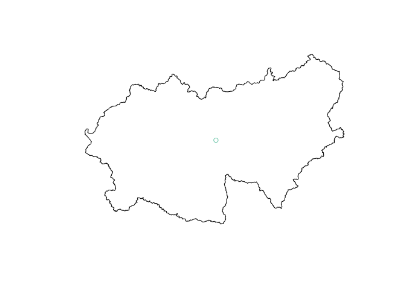

<!-- README.md is generated from README.Rmd. Please edit that file -->

# fuse.prep

<!-- badges: start -->

<!-- badges: end -->

The goal of **`{fuse.prep}`** is to prepare the input data for the
Framework for Understanding Structural Errors
([FUSE](https://naddor.github.io/fuse/)).

## Installation

You can install the development version of **{`fuse.prep`}** from
[GitHub](https://github.com/) with:

``` r
# install.packages("devtools")
devtools::install_github("lhmet-ped/fuse.prep")
```

## Data

This is a basic example which shows you how to create the elevation
bands NetCDF file.

Os dados de exemplo necessários são disponibilizados com os pacotes
**`{HEgis}`** (`poly74` e `condem74`) e **`{fuse.prep}`**
(`precclim74`):

  - polígono da bacia hidrográfica do posto do ONS (Simple Feature,
    `sf`)

  - os dados de elevação do terreno (`raster`) hidrologicamente
    condicionados

  - precipitação climatológica anual (`raster`)

<!-- end list -->

``` r
library(fuse.prep)
library(HEgis)
poly74
#> Simple feature collection with 1 feature and 9 fields
#> geometry type:  POLYGON
#> dimension:      XY
#> bbox:           xmin: -51.72274 ymin: -26.85503 xmax: -48.94853 ymax: -25.22428
#> geographic CRS: SIRGAS 2000
#>   codONS codANA       nome                                   nomeOri    adkm2
#> 1     74   7659 G_B_MUNHOZ UHE Governador Bento Munhoz da Rocha Neto 30207.57
#>   volhm3        rio cobacia        tpopera                       geometry
#> 1   5779 Rio Iguaçu 8625591 Regulariza_ONS POLYGON ((-51.56304 -26.259...
condem74
#> class      : RasterLayer 
#> dimensions : 1957, 3329, 6514853  (nrow, ncol, ncell)
#> resolution : 0.0008333333, 0.0008333333  (x, y)
#> extent     : -51.7225, -48.94833, -26.855, -25.22417  (xmin, xmax, ymin, ymax)
#> crs        : +proj=longlat +datum=WGS84 +no_defs 
#> source     : memory
#> names      : layer 
#> values     : 588, 1506  (min, max)
precclim74
#> class      : RasterLayer 
#> dimensions : 8, 13, 104  (nrow, ncol, ncell)
#> resolution : 0.25, 0.25  (x, y)
#> extent     : -52, -48.75, -27, -25  (xmin, xmax, ymin, ymax)
#> crs        : +proj=longlat +datum=WGS84 +no_defs 
#> source     : memory
#> names      : layer 
#> values     : 1449.61, 2070.507  (min, max)
```

Para saber como gerar estes 3 arquivos veja a vinheta do pacote.

## Arquivo NetCDF de bandas de elevação

Tabela com frações de área da bacia hidrográfica e da precipitação por
banda de elevação.

``` r
elev_tab_format <- elev_bands(con_dem = condem74, meteo_raster = precclim74, dz = 100)
#>   |                                                                              |                                                                      |   0%  |                                                                              |==================                                                    |  25%  |                                                                              |===================================                                   |  50%  |                                                                              |====================================================                  |  75%  |                                                                              |======================================================================| 100%
#> 
#>   |                                                                              |                                                                      |   0%  |                                                                              |===================================                                   |  50%
elev_tab_format
#> # A tibble: 10 x 6
#>     zone   inf   sup mean_elev   area_frac prec_frac
#>    <dbl> <dbl> <dbl>     <dbl>       <dbl>     <dbl>
#>  1     1   588   688       638 0.000276    0.0000591
#>  2     2   688   788       738 0.133       0.135    
#>  3     3   788   888       838 0.394       0.389    
#>  4     4   888   988       938 0.259       0.255    
#>  5     5   988  1088      1038 0.104       0.109    
#>  6     6  1088  1188      1138 0.0789      0.0819   
#>  7     7  1188  1288      1238 0.0284      0.0266   
#>  8     8  1288  1388      1338 0.00330     0.00296  
#>  9     9  1388  1488      1438 0.000104    0.0000155
#> 10    10  1488  1588      1538 0.000000765 0
```

Escrita do arquivo NetCDF de bandas de elevação.

``` r
# lon  e lat do centróide do polígono
library(sf)
#> Linking to GEOS 3.8.0, GDAL 3.0.4, PROJ 6.3.1
ll_74 <- suppressWarnings(st_centroid(poly74))
plot(st_geometry(poly74))
plot(ll_74, add = TRUE)
#> Warning in plot.sf(ll_74, add = TRUE): ignoring all but the first attribute
```



``` r
lon_74 <- st_coordinates(ll_74)[[1]]
lat_74 <- st_coordinates(ll_74)[[2]]
  
elev_bands_file_nc <- elev_bands_nc(
  elev_tab = elev_tab_format,
  lon = lon_74,
  lat = lat_74,
  file_nc = file.path(tempdir(), "elevation_bands_74.nc"),
  na = -9999
)
elev_bands_file_nc
#> [1] "/tmp/Rtmpse5fV8/elevation_bands_74.nc"
file.exists(elev_bands_file_nc)
#> [1] TRUE
```

Verificação do arquivo gerado.

``` r
#if (requireNamespace("tidync", quietly = TRUE)) {
  library(tidync)
  out <- tidync(elev_bands_file_nc) %>% hyper_tibble()
  # compara arquivo de exemplo do FUSE
  ref <- tidync("~/Dropbox/github/my_reps/lhmet/HEgis/refs/fuse_catch/input/us_09066300_elev_bands.nc") %>% hyper_tibble()
  
#}
out
#> # A tibble: 10 x 6
#>      area_frac mean_elev prec_frac longitude latitude elevation_band
#>          <dbl>     <dbl>     <dbl>     <dbl>    <dbl>          <dbl>
#>  1 0.000276          638 0.0000591     -50.3    -26.0              1
#>  2 0.133             738 0.135         -50.3    -26.0              2
#>  3 0.394             838 0.389         -50.3    -26.0              3
#>  4 0.259             938 0.255         -50.3    -26.0              4
#>  5 0.104            1038 0.109         -50.3    -26.0              5
#>  6 0.0789           1138 0.0819        -50.3    -26.0              6
#>  7 0.0284           1238 0.0266        -50.3    -26.0              7
#>  8 0.00330          1338 0.00296       -50.3    -26.0              8
#>  9 0.000104         1438 0.0000155     -50.3    -26.0              9
#> 10 0.000000765      1538 0             -50.3    -26.0             10
```

``` r
ref
#> # A tibble: 14 x 6
#>    area_frac mean_elev prec_frac longitude latitude elevation_band
#>        <dbl>     <dbl>     <dbl>     <dbl>    <dbl>          <dbl>
#>  1   0.00511      2450   0.00511      39.6     39.6              1
#>  2   0.0132       2550   0.0132       39.6     39.6              2
#>  3   0.0196       2650   0.0196       39.6     39.6              3
#>  4   0.0312       2750   0.0312       39.6     39.6              4
#>  5   0.0556       2850   0.0556       39.6     39.6              5
#>  6   0.0836       2950   0.0836       39.6     39.6              6
#>  7   0.126        3050   0.126        39.6     39.6              7
#>  8   0.158        3150   0.158        39.6     39.6              8
#>  9   0.180        3250   0.180        39.6     39.6              9
#> 10   0.149        3350   0.149        39.6     39.6             10
#> 11   0.0897       3450   0.0897       39.6     39.6             11
#> 12   0.0618       3550   0.0618       39.6     39.6             12
#> 13   0.0271       3650   0.0271       39.6     39.6             13
#> 14   0.00124      3750   0.00124      39.6     39.6             14
```

## Arquivo NetCDF de forçantes meteorológicas

<https://github.com/naddor/tofu/blob/master/input_output_settings/write_forcing.R>
