```{r, include = FALSE}
options(rmarkdown.html_vignette.check_title = FALSE)
knitr::opts_chunk$set(
  collapse = TRUE,
  comment = "#>"
)
```

# Introdução 

O pacote **`{fuse.prep}`** prepara os dados de elevação do terreno e de forçantes hidrometeorológicas necessários para criação dos arquivos NetCDF de entrada do FUSE para uma bacia hidrográfica (**BH**). 

Nesta vinheta descreve-se o pré-processamento dos dados necessários para geração 
do **arquivo NetCDF das forçantes meteorológicas**. Este processo é ilustrado 
na Figura \@ref(fig:fluxograma-fm).

```{r mermaid, echo = FALSE, eval = FALSE}
## Colar texto abaixo em
# https://mermaid-js.github.io/mermaid-live-editor
## e Download svg
## site referência 
# https://mermaid-js.github.io/mermaid/diagrams-and-syntax-and-examples/flowchart.html
## OBS: é possível utilizar mermaid direto no R com o pacote DiagrammeR, mas
## há somente alguns recursos de design.
#univar_flowchart = "
graph TD
   DCB[(Dados Meteorológicos BR)] --> |brick-prec-25km-19800101-20151231.nc| INC[import_nc]
   DCB[(Dados Meteorológicos BR)] --> |brick-ET0-25km-19800101-20151231.nc| INC[import_nc] 
  subgraph fuse.prep
%%    subgraph HEgis
%%       IP[/info_posto/]
%%       IP --> |posto| C3[extract_poly]
%%       C3 --> PS[/poly_station/] 
%%    end

     subgraph HEgis
      C1[/Parte do nome do posto/] -->|name_regex| C2[info_station]
      C2 --> IP[/info_posto/]
      IP --> |posto| C3[extract_poly]
      C3 --> PS[/poly_posto/] 
     end

    PS --> |poly_station| SA[spatial_average]
    PS -->|id| DQN
     subgraph HEobs
       DQ[(Dados Vazão Natural)] --> |VazoesNaturaisONS_D_87UHEsDirceuAssis_2018| DQN[extract_qnat]
     end

     INC --> PB[/prec_brick/]
     INC --> ETB[/et0_brick/]
      PB --> SA
      ETB --> SA
       SA --> PP[\prec_posto\]
       SA --> EP[\et0_posto\]
        PP --> CD
        EP --> CD
   PS --> |área| CD[comb_data]
   DQN --> CD 
   CD --> MFNC[meteo_forcing_nc]
  end  
    
style CD stroke:#333,stroke-width:4px
style fuse.prep fill:#FFFFFF,stroke:#333,stroke-width:2px
style HEobs fill:#FCC,stroke:#F00,stroke-width:2px
		
		
#"
#mermaid(diagram = univar_flowchart, width = 800, height = 800)
```

```{r fluxograma-fm, echo = FALSE, fig.align='center', fig.cap="Fluxo de pré-processamento dos dados necessários para criação do NetCDF das Forçantes Meteorológicas. A região em amarelo indica os processos feitos com o pacote **`{HEgis}`** e em vermelho pelo pacote  **`{HEobs}`**", out.width='95%'}

```


# Pré-requisitos

## Pacotes 

```{r pcks, message=FALSE, warning=FALSE}
library(HEgis)
library(HEobs)
library(lhmetools)
library(fuse.prep)
library(raster)
library(dplyr)
library(fs)
```

## Base de dados

Para demonstrar o pré-processamento dos dados precisamos de uma base de dados meteorológicos observados sobre a região da BH de interesse. Para BH com área de drenagem totalmente dentro do território nacional a base de dados diários gradeados de variáveis meteorológicas para o Brasil ([Xavier et al 2017](https://proceedings.science/sbsr/papers/an-update-of-xavier--king-and-scanlon--2016--daily-precipitation-gridded-data-set-for-the-brazil), [Xavier et al. 2016](https://rmets.onlinelibrary.wiley.com/doi/full/10.1002/joc.4518)) é uma opção atrativa para fins de pesquisa.

Esta base de dados também foi usada no pré-processamento dos dados de bandas de elevação (ver vinheta **[Pré-processamento dos dados de bandas de elevação](pp-elevbands.html)**).


```{r, eval = FALSE}
(nc_files <- meteo_nc(c("prec", "et0"), dest_dir = "input"))
```

```
"input/"
```

## Exemplo de dados pré-processados

A função chave do pré-processamento dos dados necessários para criação do arquivo NetCDF das forçantes meteorológicas é a `comb_data()`, retângulo com linha mais grossa na Figura \@ref(fig:fluxograma-fm). A saída desta função é um *tibble*, ou *data frame*, com as séries temporais das variáveis meteorológicas disponíveis para a BH de interesse (pelo menos precipitação, evapotranspiração potencial e vazão observada). Esta tabela é usada como entrada na função `meteo_forcing_nc()` para gerar o arquivo NetCDF de entrada para o FUSE. Um exemplo destes dados como este é o `forcdata74`, disponibilizado com o **`{fuse.prep}`**. Estes dados, assim como os usados na vinheta do pré-processamento do arquivo de bandas de elevação, referem-se a médias na área da bacia hidrográfica do posto 74 do ONS.

```{r con_dem}
forcdata74
```

# Pré-processamento

Agora veremos como obter os dados da seção anterior, seguindo o fluxo de 
trabalho da Figura \@ref(fig:fluxograma-fm). 


## Polígono da BH (`poly_station`)

A etapa de pré-processamento relacionada
ao pacote HEgis é omitida aqui, pois já foi descrita na vinheta de **[Pré-processamento dos dados de bandas de elevação](pp-elevbands.html)**. O produto pré-processado nesta etapa é o `poly_posto` que corresponde aos dados `poly74` distribuído no pacote **`{HEgis}`**.

```{r poly-posto}
(poly_posto <- poly74)
```

A partir do polígono da BH, obtemos as demais informações: o código 
identificador e a área (km^2^) da BH.

```{r info-posto}
(id_posto <- poly_posto$codONS)
(area_posto <- poly_posto$adkm2)
```

Estas informações são usadas posteriormente como entrada das funções `extract_qnat()` e `comb_data()` (Figura \@ref(fig:fluxograma-fm)), respectivamente.


## Vazão observada (`qobs_posto`)

Os dados de vazão observada para a BH de interesse são obtidos da base de dados de vazão natural da ONS. Podemos baixar estes dados usando o código abaixo que salvará a base de dados `input`.
<!-- Podemos baixar estes dados usando o código abaixo que salvará a base de dados no sub-diretório `inst/extdata` do diretório de instalação do pacote `HEobs` (obtido digitando no console do R `system.file(package = "HEobs")`).  -->

```{r set-down, eval = FALSE}
dropbox_link <- "https://www.dropbox.com/s/d40adhw66uwueet/VazoesNaturaisONS_D_87UHEsDirceuAssis_2018.dat?dl=1"

# diretório de destino dentro do sub-diretório 'extdata' do pacote HEobs
dest_dir <- "input"
dir_create(dest_dir)
#dir_exists(dest_dir)

# nome do arquivo
dest_file <- dropbox_link %>% 
  path_ext_remove() %>%
  path_file() %>%
  paste0(".dat") %>%
  path(dest_dir, .)

# faz download se o arquivo não existir
if(!file_exists(dest_file)){
 download.file(dropbox_link, dest_file, mode = "wb")  
}
```

```{r set-down-old, eval = FALSE, echo = FALSE}
dropbox_link <- "https://www.dropbox.com/s/d40adhw66uwueet/VazoesNaturaisONS_D_87UHEsDirceuAssis_2018.dat?dl=1"

# diretório de destino dentro do sub-diretório 'extdata' do pacote HEobs
dest_dir <- system.file(package = "HEobs") %>%
  path("inst/extdata")
dir_create(dest_dir)
#dir_exists(dest_dir)

# nome do arquivo
dest_file <- dropbox_link %>% 
  path_ext_remove() %>%
  path_file() %>%
  paste0(".dat") %>%
  path(dest_dir, .)

# faz download se o arquivo não existir
if(!file_exists(dest_file)){
 download.file(dropbox_link, dest_file, mode = "wb")  
}
```

A função `extract_qnat()` do pacote **`{HEobs}`**, extrai da base de dados de vazão natural os dados da BH de interesse.

```{r down-qnat, eval = FALSE}
qobs_posto <- extract_qnat(
  qnat_file = dest_file,
  stn_id = id_posto,
  save = FALSE
)
str(qobs_posto)
```

```
Show in New WindowClear OutputExpand/Collapse Output
tibble [18,536 × 3] (S3: tbl_df/tbl/data.frame)
 $ date : Date[1:18536], format: "1968-04-02" ...
 $ posto: num [1:18536] 74 74 74 74 74 74 74 74 74 74 ...
 $ qnat : num [1:18536] 265 325 325 330 348 ...
 - attr(*, ".internal.selfref")=<externalptr> 
```

## Médias das forçantes meteorológicas na área da BH

Os dados diários meteorógicos gradeados de precipitação (`prec`) e evapotranspiraçã (`et0`) potencial são importados (ou baixados[^1] se eles não forem encontrados no diretório especificado em `dest_dir`) com o código abaixo.

[^1]: O download de cada arquivo NetCDF pode demorar e requer **1.5 GB!** de espaço. Se você optar por baixar manualmente cada arquivo, não altere o nome original dos arquivos. As datas são derivadas a partir do nome dos arquivos.


```{r meteo_raster-flux, eval = FALSE}
# lê arquivo de prec diária ou faz download se ele não estiver no dest_dir
prec_brick <- import_nc(
  varnc = "prec",
  dest_dir = "input"
)
et0_brick <- import_nc(
  varnc = "et0",
  dest_dir = "input"
)
```


```{r meteo_raster-flux-old, eval = FALSE, include = FALSE}
# lê arquivo de prec diária ou faz download se ele não estiver no dest_dir
prec_brick <- import_nc(
  varnc = "prec",
  dest_dir = system.file("extdata", package = "fuse.prep")
)
et0_brick <- import_nc(
  varnc = "et0",
  dest_dir = system.file("extdata", package = "fuse.prep")
)
```

A função `spatial_average()` determina a média da variável meteorológica sobre a área da BH. Os nomes padrões das variáveis no FUSE  são `pr` para precipitação e `pet` para evapotranspiração potencial. Por isso, usamos estes nomes no argumento `var_name` que armazenará o nome da variável que será escrita no NetCDF.  

```{r sp-avg, eval = FALSE}
prec_posto <- spatial_average(
  meteo_brick = prec_brick, 
  poly_station = poly_posto, 
  var_name = "pr",
  fun = mean
)
str(prec_posto)
```
```
tibble [13,149 × 3] (S3: tbl_df/tbl/data.frame)
 $ date : Date[1:13149], format: "1980-01-01" ...
 $ posto: int [1:13149] 74 74 74 74 74 74 74 74 74 74 ...
 $ pr   : num [1:13149] 0.3299 0.0578 0.1773 0.0476 0.0517 ...
```

```{r sp-avg-pet, eval = FALSE}
pet_posto <- spatial_average(
  meteo_brick = et0_brick, 
  poly_station = poly_posto, 
  var_name = "pet",
  fun = mean
)
str(pet_posto)
```

```
tibble [13,727 × 3] (S3: tbl_df/tbl/data.frame)
 $ date : Date[1:13727], format: "1980-01-01" ...
 $ posto: int [1:13727] 74 74 74 74 74 74 74 74 74 74 ...
 $ pet  : num [1:13727] 5.41 5.01 5.36 5.57 5.49 ...
``` 

Os dados pré-processados (`prec_posto`, `pet_posto`, `qobs_posto`) são então combinados para serem usados na criação do NetCDF das forçantes meteorológicas. Esta tabela de dados salvaremos no diretório `output`, pois pode ser útil para análise diagnóstica do fechamento do balanço e cálculo de assinaturas hidrológicas.

```{r comb-data, eval = FALSE}
if(!dir_exists("output")) dir_create("output")
meteo_data <- comb_data(
  prec = prec_posto,
  et0 = pet_posto,
  qobs = qobs_posto,
  area = area_posto,
  save = TRUE,
  prefix = "meteo-data-posto-",
  dest_dir = "output"
)
str(meteo_data)
```

```
tibble [13,149 × 6] (S3: tbl_df/tbl/data.frame)
 $ date   : Date[1:13149], format: "1980-01-01" ...
 $ station: num [1:13149] 74 74 74 74 74 74 74 74 74 74 ...
 $ pr     : num [1:13149] 0.3299 0.0578 0.1773 0.0476 0.0517 ...
 $ pet    : num [1:13149] 5.41 5.01 5.36 5.57 5.49 ...
 $ qnat   : num [1:13149] 631 573 500 467 425 ...
 $ q_obs  : num [1:13149] 1.81 1.64 1.43 1.34 1.22 ...
```


# Criação do NetCDF das forçantes meteorológicas

Os dados `meteo_data` são usados como entrada função `meteo_forcing_nc()`. Então podemos gerar o arquivo NetCDF das forçantes meteorológicas para o posto 74, passando cada coluna daqueles dados, além das coordenadas do centróide da BH:

```{r write-forcs, eval = FALSE}
# arquivo de saída
forcings_nc <- path("output", "posto74_input.nc")
# exporta dados para netcdf
meteo_forcing_nc(
  forc_tbl = meteo_data,
  ccoords = centroids(poly_station = poly_posto),
  file_nc = forcings_nc 
)
file.exists(forcings_nc)
```

```
"./input/posto74_input.nc"
[1] TRUE
```


